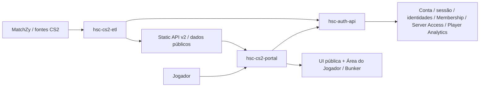

# Domínio do HSC CS2 Portal

## Responsabilidade

O `hsc-cs2-portal` é a experiência pública/player-facing de Counter-Strike 2 do ecossistema HSC.

A aplicação apresenta dados competitivos, incluindo rankings, partidas, mapas e Seasons. Também concentra experiências ligadas à identidade do jogador, como autenticação, perfil público, Área do Jogador e Bunker.

O Portal não gera analytics competitivos, não persiste identidades e não executa operações administrativas. Essas responsabilidades pertencem, respectivamente, ao ETL upstream, à Auth API e ao Backoffice.

## Fluxo no ecossistema

Superfícies públicas leem os dados correspondentes da Static API v2. Superfícies autenticadas usam a Auth API como autoridade consumida para conta, sessão, identidades, Membership, Server Access e Player Analytics/Bunker aceitos. O ETL produz os cálculos competitivos upstream; o Portal não executa ETL nem acessa seus artefatos internos.

O frontend seleciona, filtra quando permitido, formata e apresenta dados publicados. Regras de negócio e cálculos pertencentes aos serviços upstream não devem ser reimplementados no Portal.

## Capacidades funcionais

O Portal é responsável por:

- apresentar rankings e estatísticas competitivas;
- navegar por Seasons e seus resultados;
- apresentar partidas e mapas;
- exibir notícias destinadas ao jogador;
- apresentar perfis públicos de jogadores;
- oferecer autenticação e gerenciamento player-facing da conta;
- renderizar a Área do Jogador e o Bunker;
- apresentar Player Analytics nos contextos Season e Lifetime sem fallback cruzado.

## Glossário

**Season**  
Recorte competitivo definido pelo HSC. O frontend apresenta os dados e relações fornecidos pelas APIs, sem inferir pertencimento ou recalcular resultados.

**Player Bunker**  
Superfície autenticada de Player Analytics dentro do Portal. Usa um contexto global Season ou Lifetime e apresenta os dados publicados sem criar classificações ou métricas competitivas locais.

**Área do Jogador**  
Conjunto de experiências autenticadas para conta, perfil, identidade, segurança e acesso do jogador.

**Steam OpenID**  
Mecanismo usado para autenticação ou vínculo de identidade Steam. A validação e a sessão pertencem à Auth API, não ao frontend.

**Competitive Profile**  
Visão Lifetime do desempenho competitivo disponibilizada para apresentação no Portal. Não deve ser usada como fallback para dados ausentes de Season, nem o inverso.

**Static API v2**  
Fonte de dados públicos de leitura consumida pelas superfícies correspondentes do Portal.

**Auth API**  
Autoridade consumida pelas superfícies autenticadas para conta, autenticação, sessão, identidades, perfis, Membership, Server Access e Player Analytics/Bunker aceitos.

**ETL**

Pipeline responsável por produzir e calcular analytics competitivos upstream. Seus artefatos internos não são consumidos diretamente pelo Portal.
