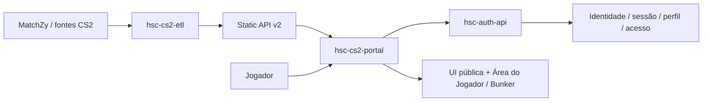

# Domínio do HSC CS2 Portal

## Responsabilidade

O `hsc-cs2-portal` é a experiência pública/player-facing de Counter-Strike 2 do ecossistema HSC.

A aplicação apresenta dados competitivos produzidos pelo pipeline do HSC, incluindo rankings, partidas, mapas e Seasons. Também concentra experiências ligadas à identidade do jogador, como autenticação, perfil público, Área do Jogador e Bunker.

O Portal não gera os dados competitivos, não persiste identidades e não executa operações administrativas. Essas responsabilidades pertencem, respectivamente, ao pipeline/Static API v2, à Auth API e ao Backoffice.

## Fluxo no ecossistema

O Portal lê artefatos públicos da Static API v2 para a experiência competitiva e usa a Auth API para operações dependentes da identidade e sessão do jogador. Regras de negócio pertencentes a esses serviços não devem ser reimplementadas no frontend.

## Capacidades funcionais

O Portal é responsável por:

- apresentar rankings e estatísticas competitivas;
- navegar por Seasons e seus resultados;
- apresentar partidas e mapas;
- exibir notícias destinadas ao jogador;
- apresentar perfis públicos de jogadores;
- oferecer autenticação e gerenciamento player-facing da conta;
- renderizar a Área do Jogador e o Bunker;
- apresentar dados de perfil competitivo disponibilizados pelas fontes do ecossistema.

## Glossário

**Season**  
Recorte competitivo definido pelo HSC. O frontend apresenta os dados e relações fornecidos pelas APIs, sem inferir pertencimento ou recalcular resultados.

**Player Bunker**  
Superfície autenticada de estatísticas e contexto competitivo do jogador dentro do Portal.

**Área do Jogador**  
Conjunto de experiências autenticadas para conta, perfil, identidade, segurança e acesso do jogador.

**Steam OpenID**  
Mecanismo usado para autenticação ou vínculo de identidade Steam. A validação e a sessão pertencem à Auth API, não ao frontend.

**Competitive Profile**  
Visão de identidade e desempenho competitivo disponibilizada para apresentação no Portal, podendo combinar contexto de Season e informações agregadas fornecidas pelas APIs.

**Static API v2**  
Conjunto de artefatos públicos de leitura gerados pelo pipeline de dados do CS2 e consumidos pelo Portal.

**Auth API**  
Serviço responsável pelos fluxos de identidade, autenticação, sessão, perfis e demais regras server-side relacionadas ao jogador.
